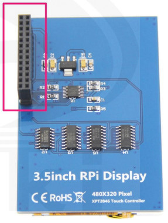
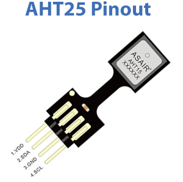
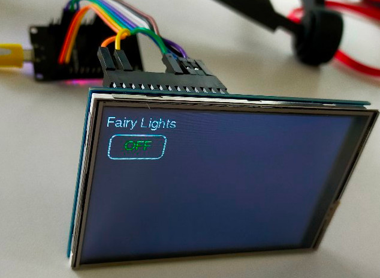

# Controller for my lounge - PlatformIO version

## References

* [3.5" RPi Display User Manual][def]
* [3.5" RPi Display][def2]
* SKU: MPI3501
* Touch Chipset: XPT2046
* Driver IC: ILI9486
* AHT25

## In My Project

* Library: TFT_eSPI, and TFT_eWidget for the button
* TFT_eSPI User Setup: See [platformio.ini](./platformio.ini)
* Adafruit_AHTX0
* WiFi.h
* PubSubClient
* ArduinoJson, for the sensor payload
* ArduinoOTA, for flashing over the air
* LittleFS, for the stored touch calibration

## Make Targets

`make help` lists them. The common ones:

| Target | Does |
| ------ | ---- |
| `make` | compile the firmware |
| `make upload` | flash over USB |
| `make ota` | flash over the air to `mpi3501.local` |
| `make upload-monitor` | flash over USB, then open the serial monitor |
| `make monitor` | open the serial monitor |
| `make test` | run the host unit tests |
| `make check` | static analysis |
| `make check-secrets` | report which keys `../.secrets` is missing |
| `make clean` | remove build output |

`make`, `make upload` and `make ota` all run `check-secrets` first, so a missing
key is reported by name before the compiler gets involved. It prints key names
only, never values.

Everything is a thin wrapper over `pio`; override `PIO`, `FIRMWARE_ENV`,
`OTA_ENV` or `SECRETS` if you need to.

The OTA environment has its own build directory, so the first `make ota` after
a `make` recompiles from scratch. It also needs firmware already on the board
that calls `ArduinoOTA.handle()`, so use `make upload` over USB at least once.

`make ota` is verified working: 25 seconds end to end, after which the board
software-resets itself into the new image. The boot line reports the build, so
you can confirm which firmware is running without opening anything up:

```
Starting, firmware 838c485
```

That string is `git describe` at build time, passed in by `scripts/version.sh`.
A dirty tree shows as `<hash>-dirty`, which is worth noticing before you send a
build to something screwed to a wall.

## Build Configuration

Secrets live in `../.secrets` (outside the repo), one `KEY value` pair per
line. All of these are required; `scripts/secret.sh` aborts the build with the
offending key name if one is missing or empty, rather than silently compiling
in an empty string.

| Key | Example |
| --- | ------- |
| `WIFI_SSID` | `my-network` |
| `WIFI_PWD` | `hunter2` |
| `TIMEZONE` | `NZST-12NZDT,M9.5.0,M4.1.0/3` |
| `MQTT_BROKER` | `homeassistant.local` |
| `MQTT_PORT` | `1883` |
| `MQTT_USER` | `screen` |
| `MQTT_PWD` | `hunter2` |

Values are read with `awk '$1 == key { print $2 }'`, so they cannot contain
spaces.

The MQTT topics are derived from the MAC address and logged over serial at
boot; check there for the state and availability topics to point Home
Assistant at.

## Tests

The pure logic — mapping the bin day sensor and parsing MQTT payloads — lives
in `lib/BinDay` and `lib/MqttPayload` with no Arduino dependency, so it
compiles for the host:

```sh
make test
```

That covers every payload the sensors can produce, including the "unknown" and
"unavailable" placeholders, in about a second. Everything else in
`src/main.cpp` touches hardware and is not covered.

`pio run` builds the firmware only; the native environment is opt-in.

## Bin Day

The coloured circle shows which bin goes out next: red for landfill, yellow for
recycling. The schedule is **not** computed on the device. It comes from a
Home Assistant template sensor, `sensor.bin_day`, over MQTT:

```yaml
template:
  - sensor:
    - name: bin_day
      state: "{% set dt = strptime('Sep 26 2024', '%b %d %Y') %}
              {% set landiff = ((now().timestamp() / 86400) - (as_timestamp(dt) / 86400)) % 14 %}
              RecyclesLandfill"
    trigger:
     - platform: time_pattern
       minutes: "/1"
```

Collections are on Wednesdays, and each block runs Thursday to Wednesday so the
colour holds through the morning the bin actually goes out. The firmware only
maps the payload (`lib/BinDay`), holding its last good value when the sensor
reports `unknown` or `unavailable` so the circle never blanks.

The device used to derive this itself from an epoch date. That is gone,
because it had drifted: it used the same 26 September 2024 anchor but the
opposite phase convention, so it disagreed with Home Assistant on every
Thursday — showing the bin that had just gone out rather than the one due
next. One schedule, in one place, is worth more than a local fallback.

## MPI3501 Pins

These took some working out. The above two reference documents each had some
parts but neither was clear about what pin 22 was for. Trial and error got it
working, and the answer is recorded below: **pin 22 is the display reset
(LCD_RST), and pin 18 is the register select / data-command line (LCD_RS)**.
The `TFT_RST` and `TFT_DC` values in [platformio.ini](./platformio.ini) are the
authority here, since that is the configuration the firmware actually runs on.



| Description | # | # | Description |
| ----------- | - | - | ----------- |
| Power Input 5v | 2 | 1 | Power Input 3.3v |
| Power Input 5v | 4 | 3 | SDA |
| GND | 6 | 5 | SCL |
| TX | 8 | 7 | P7 |
| RX | 10 | 9 | GND |
| P1 | 12 | 11 | P0 |
| GND | 14 | 13 | P2 |
| P4 | 16 | 15 | P3 |
| LCD Register Select LCD_RS | 18 | 17 | Power Input 3.3v |
| GND | 20 | 19 | SPI MOSI, shared |
| LCD Reset LCD_RST | 22 | 21 | SPI MISO, shared |
| LCD Chip Select LCD_CS | 24 | 23 | SPI SCLK, shared |
| Touch Panel Chip Select TP_CS | 26 | 25 | GND |

## AHT25 Pins



## ESP32 Connections

The right-hand column is the matching setting in
[platformio.ini](./platformio.ini). Keep the two in step: an earlier version of
this table had LCD_RS and LCD_RST swapped, which the build flags disagreed with
for a long time without anyone noticing.

### Display (MPI3501)

| ESP32 Pin | Display Pin | platformio.ini |
| --------- | ----------- | -------------- |
| D23 | #19 SPI MOSI, shared with the touch panel | `TFT_MOSI=23` |
| D19 | #21 SPI MISO, shared with the touch panel | `TFT_MISO=19` |
| D18 | #23 SPI SCLK, shared with the touch panel | `TFT_SCLK=18` |
| D15 | #24 LCD Chip Select LCD_CS | `TFT_CS=15` |
| D2 | #18 LCD Register Select LCD_RS | `TFT_DC=2` |
| D4 | #22 LCD Reset LCD_RST | `TFT_RST=4` |
| D5 | #26 Touch Panel Chip Select TP_CS | `TOUCH_CS=5` |
| VIN | #2 Display 5v | |
| GND | #6 Display GND | |

MOSI, MISO and SCLK are one bus driving both the ILI9486 and the XPT2046, which
is why the display and the touch panel each need their own chip select, and why
anything that draws to the screen has to stay on the same thread as the touch
polling.

### AHT25

| ESP32 Pin | AHT25 Pin |
| --------- | --------- |
| 3.3v | #1 VCC |
| D21 | #2 SDA |
| GND | #3 GND |
| D22 | #4 SCL |

## Code

My code displays a simple button on the screen which, when clicked, publishes to
`fairylights/toggle`. It also subscribes to the switch's state through the
StateStream integration, and colours the button to match.

The two directions are independent, and only the *reading* direction currently
works. Nothing subscribes to `fairylights/toggle` any more: the automation that
used to act on it dated from a 433MHz button read through rtl_433, and has been
removed. Pressing the on-screen button therefore does nothing until something
consumes that topic again — for example:

```yaml
automation:
  - alias: Fairy lights toggle from the lounge screen
    trigger:
      - platform: mqtt
        topic: fairylights/toggle
    action:
      - service: switch.toggle
        target:
          entity_id: switch.dining_room_light_switch_switch_3
```

The switch itself has changed hardware over time — it began as a Sonoff
(eWeLink) and is now one gang of a 3-gang light switch reporting through the
Tuya integration. That is why the firmware builds its topics from an entity id
that is easy to repoint rather than from a hard-coded topic string. Also set up in Home Assistant is the StateStream integration which publishes the change of state of the switch, which my code listens to and changes the colour of the button appropriately.

My code contains examples of how to:

* Keep credentials out of the source tree, as build flags from `../.secrets`
* Connect to WiFi
* Run a touch screen
* Set hostname via mDNS, which is what makes `make ota` able to find the board
* Connect to an MQTT broker
* Both publish and subscribe to the MQTT broker
* Calibrate a touchscreen and store the data in LittleFS

Entirely based on the examples from TFT_eSPI, PubSubClient and some others I don't remember.

* [My code](./src/main.cpp)
* State Stream setup in Home Assistant's `configuration.yaml`

The button tracks a Home Assistant entity, so it breaks when that entity is
renamed or replaced. The subscribed topics are built from entity ids near the
top of [src/main.cpp](./src/main.cpp) — `FAIRY_SWITCH_ID` and
`WEATHER_ENTITY_ID` — and those ids are the only part that changes.

To find the current one, list every switch beside its friendly name:

```sh
mosquitto_sub -h <broker> -u <user> -P <pwd> -v \
              -t 'homeassistant/switch/+/friendly_name'
```

Two dead entities still linger in the broker as retained messages, both named
`"Fairy Lights "` with a trailing space and both stuck at `unavailable`:
`switch.fairy_lights_sonoff_1001ffea20_1` and
`light.living_room_fairy_lights`. The live one is
`switch.dining_room_light_switch_switch_3`, named `"Fairy Lights"`. Pick the
one that actually reports a state.

Note that the toggle is a separate path: the button publishes to
`fairylights/toggle`, and the Home Assistant automation listening there has to
target the new entity too. Changing the entity id in the firmware only fixes
which state the screen *reads*.

`- weather` is required in `domains` below, along with
`publish_attributes: true`, for the two weather topics to exist at all, since
humidity and temperature are attributes of the weather entity rather than its
state. It was added here by inference from the topics arriving on the broker,
so check it against the live `configuration.yaml`, which is the authority.

```yaml
mqtt_statestream:
  base_topic: homeassistant
  publish_attributes: true
  publish_timestamps: true
  include:
    domains:
        - switch
        - weather
    entities:
        - switch.dining_room_light_switch_switch_3
```

* Sensor Setup

If Home Assistant shows a temperature and humidity that never change, check
the topic first. MQTT retains the last value, so after the topic changed, Home
Assistant carried on displaying the reading the old firmware had left behind on
`home/screen/481635231/state` and looked healthy while being six hours stale.
Clear a dead topic with `mosquitto_pub -t <topic> -r -n`.

The topics below are the real ones for this board, read off the serial log at
boot. They are derived from the MAC, so a different board gives different
topics: check the log rather than copying these.

```yaml
mqtt:
  - sensor:
    - name: "Temperature"
      state_topic: "home/screen/30A3341F/state"
      availability_topic: "home/screen/30A3341F/availability"
      suggested_display_precision: 1
      unit_of_measurement: "C"
      value_template: "{{ value_json.temperature }}"
    - name: "Humidity"
      state_topic: "home/screen/30A3341F/state"
      availability_topic: "home/screen/30A3341F/availability"
      suggested_display_precision: 1
      unit_of_measurement: "%"
      value_template: "{{ value_json.humidity }}"

```



[def]: https://cdn.awsli.com.br/945/945993/arquivos/MPI3501-3.5inch-RPi-Display-User-Manual-V1.0.pdf
[def2]: http://www.lcdwiki.com/3.5inch_RPi_Display
