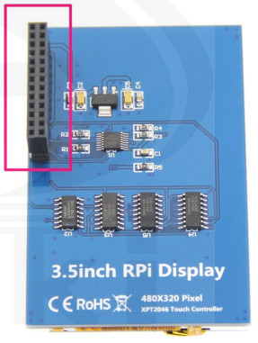
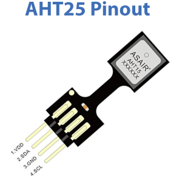
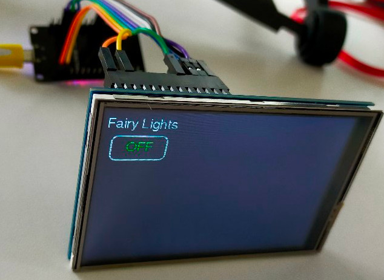

# Controller for my lounge - PlatformIO version

## References

* [3.5" RPi Display User Manual][def]
* [3.5" RPi Display][def2]
* SKU: MPI3501
* Touch Chipset: XPT2046
* Driver IC: ILI9486
* AHT25

## In My Project

* Library: TFT_eSPI
* TFT_eSPI User Setup: See [platformio.ini](./platformio.ini)
* Adafruit_AHTX0
* Preferences
* WiFi.h
* PubSubClient

## MPI3501 Pins

These took some working out. The above two reference documents each had some parts but neither was clear about what pin 22 was for. Plus a bit of trial and error, I managed to get it working.



| Description | # | # | Description |
| ----------- | - | - | ----------- |
| Power Input 5v | 2 | 1 | Power Input 3.3v |
| Power Input 5v | 4 | 3 | SDA |
| GND | 6 | 5 | SCL |
| TX | 8 | 7 | P7 |
| RX | 10 | 9 | GND |
| P1 | 12 | 11 | P0 |
| GND | 14 | 13 | P2 |
| P4 | 16 | 15 | P3 |
| LCD Reset LCD_RST | 18 | 17 | Power Input 3.3v |
| GND | 20 | 19 | Touch Panel Input MOSI |
| Touch Panel Reset TP_RST | 22 | 21 | Touch Panel Output MISO |
| LCD Chip Select LCD_CS | 24 | 23 | Touch Panel Clock SCLK |
| Touch Panel Chip Select TP_CS | 26 | 25 | GND |

## AHT25 Pins



## ESP32 Connections

| ESP32 Pin | Display Pin | AHT25 Pin |
| --------- | ----------- | --------- |
| D23 | #19 Touch Panel Input MOSI | |
| D5 | #26 Touch Panel Touch Panel Chip Select TP_CS | |
| D19 | #21 Touch Panel Output MISO | |
| D18 | #23 Touch Panel Clock SCLK | |
| D4 | #22 Touch Panel Reset TP_RST | |
| D2 | #18 LCD Reset LCD_RST | |
| D15 | #24 LCD Chip Select LCD_CS | |
| VIN | #2 Display 5v | |
| GND | #6 Display GND | |
| 3.3v | | #1 VCC |
| D21 | | #2 SDA |
| GND | | #3 GND |
| D22 | | #4 SDL |

## Code

My code displays a simple button on the screen which, when clicked, sends a message to an MQTT broker which is attached to Home Assistant via the MQTT integration. I have an Automation set up on my Sonoff (eWeLink) switch to toggle the switch on receiving this message. Also set up in Home Automation is the StateStream integration which publishes the change of state of the switch, which my code listens to and changes the colour of the button appropriately.

My code contains examples of how to:

* Store credentials in Preferences
* Connect to WiFi
* Run a touch screen
* Set hostname via mDNS (not much use as there's nothing listening in my code)
* Connect to an MQTT broker
* Both publish and subscribe to the MQTT broker
* Calibrate a touchscreen and store the data in LittleFS

Entirely based on the examples from TFT_eSPI, PubSubClient and some others I don't remember.

* [My code](./src/TouchScreen.cpp)
* State Stream setup in Home Assistant's `configuration.yaml`

```yaml
mqtt_statestream:
  base_topic: homeassistant
  publish_attributes: true
  publish_timestamps: true
  include:
    domains:
        - switch
    entities:
        - switch.sonoff_1001ffea20_1
```




[def]: https://cdn.awsli.com.br/945/945993/arquivos/MPI3501-3.5inch-RPi-Display-User-Manual-V1.0.pdf
[def2]: http://www.lcdwiki.com/3.5inch_RPi_Display
